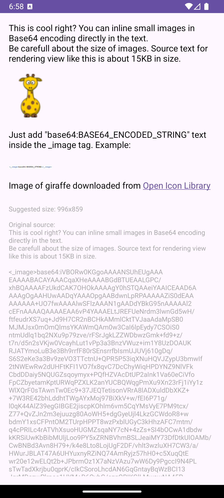
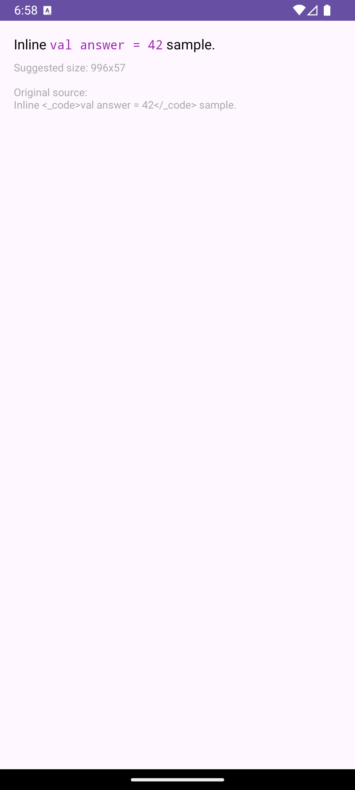
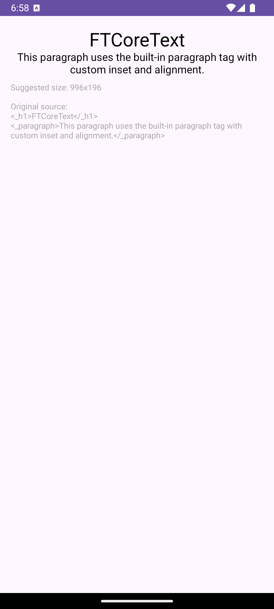
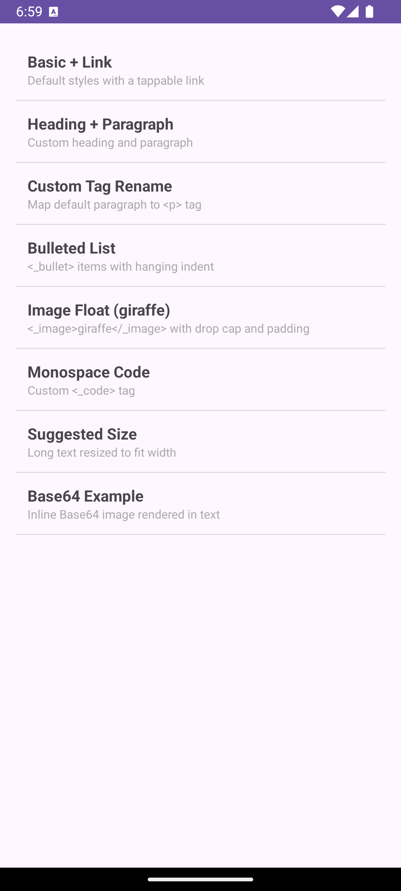

# FTCoreText

Cross‑platform rich text rendering with lightweight markup for iOS (Swift) and Android (Kotlin). The same localized strings render identically on both platforms.

## Layout
- **iOS** (Swift/SPM + Tuist demo): `ios/` — see the [iOS guide](ios/README.md)
- **Android** (Kotlin/Gradle + sample): `android/` — see the [Android guide](android/README.md)
- Shared examples (texts/images used by both demos): `shared/`

## Install
- **iOS** (Swift Package Manager)
  - Xcode → File → Add Packages… → use: `https://github.com/rafiki270/FTCoreText`
  - Or in `Package.swift`:
    ```swift
    // swift-tools-version: 6.0
    import PackageDescription

    let package = Package(
        name: "YourApp",
        dependencies: [
            .package(url: "https://github.com/rafiki270/FTCoreText.git", from: "2.1.0")
        ],
        targets: [
            .target(name: "YourApp", dependencies: ["FTCoreText"]) 
        ]
    )
    ```

- **Android** (Gradle)
  - Open `android/` in Android Studio; the sample app already depends on the library module.
  - For your own app, either depend on the local module during development:
    ```kotlin
    // settings.gradle.kts
    include(":ftcoretext")

    // app/build.gradle.kts
    dependencies { implementation(project(":ftcoretext")) }
    ```
    …or (once published) add the Maven artifact:
    ```kotlin
    repositories { mavenCentral() }
    dependencies { implementation("io.liveui:ftcoretext-android:2.1.0") }
    ```

## Learn More
- **iOS** details (SPM usage, Tuist demo): [ios/README.md](ios/README.md)
- **Android** details (Gradle usage, sample app): [android/README.md](android/README.md)


## Screenshots

### iOS
<table>
  <tr>
    <td>
      <a href="screenshots/ios/Simulator Screenshot - iPhone 16 Pro - 2025-09-10 at 18.59.12.png">
        
      </a>
    </td>
    <td>
      <a href="screenshots/ios/Simulator Screenshot - iPhone 16 Pro - 2025-09-10 at 18.59.15.png">
        
      </a>
    </td>
    <td>
      <a href="screenshots/ios/Simulator Screenshot - iPhone 16 Pro - 2025-09-10 at 18.59.17.png">
        
      </a>
    </td>
  </tr>
  <tr>
    <td>
      <a href="screenshots/ios/Simulator Screenshot - iPhone 16 Pro - 2025-09-10 at 18.59.20.png">
        
      </a>
    </td>
    <td>
      <a href="screenshots/ios/Simulator Screenshot - iPhone 16 Pro - 2025-09-10 at 18.59.24.png">
        
      </a>
    </td>
    <td>
      <a href="screenshots/ios/Simulator Screenshot - iPhone 16 Pro - 2025-09-10 at 18.59.28.png">
        
      </a>
    </td>
  </tr>
  <tr>
    <td>
      <a href="screenshots/ios/Simulator Screenshot - iPhone 16 Pro - 2025-09-10 at 18.59.32.png">
        
      </a>
    </td>
    <td></td>
    <td></td>
  </tr>
</table>

### Android
<table>
  <tr>
    <td>
      <a href="screenshots/android/Screenshot_20250910_185809.png">
        
      </a>
    </td>
    <td>
      <a href="screenshots/android/Screenshot_20250910_185830.png">
        
      </a>
    </td>
    <td>
      <a href="screenshots/android/Screenshot_20250910_185846.png">
        
      </a>
    </td>
  </tr>
  <tr>
    <td>
      <a href="screenshots/android/Screenshot_20250910_185854.png">
        
      </a>
    </td>
    <td>
      <a href="screenshots/android/Screenshot_20250910_185905.png">
        
      </a>
    </td>
    <td></td>
  </tr>
</table>

## License
- MIT. See [LICENSE](LICENSE).
